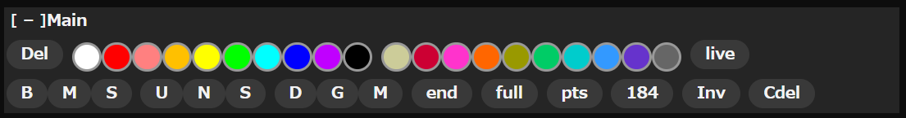

# 段スク水 説明書


段スク水とはニコニコ動画のプレイヤー上で機能するコメントアート制作・投下支援ツールである。

不具合や要望等は、Discord/[GitHub](https://github.com/eneko0513/NicoNicoDansaScriptCustom/issues)/[制作者](https://github.com/eneko0513/NicoNicoDansaScriptCustom/blob/main/README.md#%E4%BD%9C%E8%80%85)の DM 等にお願いします。

## Trace


- `全出力`,`等幅全出力`,`投コメ全出力`,`投コメ等幅全出力`,`選択出力`,`等幅選択出力`,`投コメ選択出力`  
  現在のレイヤーデータを Box のテキストエリアに出力する。適応可能な設定は[`Output`](#output)のもの。ボタンの説明は次の通り。
  - `全出力`: 全てのレイヤーを出力
  - `選択出力`: 選択中のレイヤーを出力
  - `等幅`: 全てのコメントの横幅を同じくらいになるよう空白で調整する。naka 使用時などに適切
  - `投コメ`: コメント分割の基準を投コメサイズ(=1024)にする。
- `TabM`(ON/OFF): 出力時、全角空白 x2 を[tb]に置き換える
- `置換M`(ON/OFF): 出力時、0-6 を\u200(n)に置き換える。スペースは\u2005 に置き換えられる
- [`設定`](#設定)
- `編集/編集+プレビュー/プレビュー`: レイヤー描写モードを切り替えることができる。

- `一括表示`/`一括非表示`: 全てのレイヤーの表示/非表示を切り替える。
- `グリッド`(ON/OFF): テンプレに適したグリッドを表示させる。
- [`背景設定`](#背景設定)
- `スクショ`: プレイヤーのスクリーンショットを保存する。動画とコメントが含まれる。
- `コメショ`: コメントのみのスクリーンショットを透過画像として保存する。動画は含まれない。

- `ファイルに保存`: エディターのデータを`dansk.json`形式で保存する。
- `ファイルから読込`: `dansk.json`形式、もしくは D ツールの`xml`形式を読み込む。
- [`バックアップから読込`](#バックアップ)

### レイヤー設定

ドロップダウンからテンプレートを選び、`追加`ボタンを押すことでレイヤーを追加できる。

#### テンプレート

| テンプレ名            | 行数 | ずらし可能 | naka 可能 | 積み | 説明              |
| --------------------- | ---- | ---------- | --------- | ---- | ----------------- |
| big ender 9           | 9    | 〇         | 〇        | ×    | おすすめ          |
| big ender 10 流       | 10   | ×          | 〇        | ×    |                   |
| big ender 10 臨       | 10   | 〇         | ×         | ×    |                   |
| big ender 11 臨       | 11   | 〇         | ×         | ×    |                   |
| big ender 12 臨       | 12   | 〇         | ×         | ×    |                   |
| big ender 13 臨       | 13   | 〇         | ×         | ×    |                   |
| big ender 15 臨       | 15   | 〇         | ×         | ×    |                   |
| big ender 16 臨       | 16   | 〇         | ×         | ×    |                   |
| big 16                | 16   | 〇         | 〇        | ×    | おすすめ          |
| big 17 流             | 17   | ×          | 〇        | ×    |                   |
| medium ender 14       | 14   | 〇         | 〇        | ×    | おすすめ          |
| medium ender 15 流    | 15   | ×          | 〇        | ×    |                   |
| medium ender 19 臨    | 19   | 〇         | ×         | ×    |                   |
| medium 26             | 26   | 〇         | 〇        | ×    | おすすめ,視コメ用 |
| medium 27 流          | 27   | ×          | 〇        | ×    |                   |
| small ender 21        | 21   | 〇         | 〇        | ×    | おすすめ          |
| small ender 22 流     | 22   | ×          | 〇        | ×    |                   |
| small 38              | 38   | 〇         | 〇        | ×    | おすすめ,視コメ用 |
| small 39 流           | 39   | ×          | 〇        | ×    |                   |
| medium shita W50      | 22   | ×          | ×         | 〇   |                   |
| small ue W37 L2       | 18   | 〇         | ×         | 〇   |                   |
| small shita W37 L2    | 18   | ×          | ×         | 〇   |                   |
| small ue W54          | 31   | 〇         | ×         | 〇   |                   |
| Tokome medium 26      | 26   | 〇         | 〇        | ×    | おすすめ,投コメ用 |
| Tokome medium 27 流   | 27   | ×          | 〇        | ×    | 投コメ用          |
| Tokome small 38       | 38   | ×          | 〇        | ×    | おすすめ,投コメ用 |
| Tokome small 39 流    | 39   | ×          | 〇        | ×    | 投コメ用          |
| small shita W27 L2&L1 | 18   | 〇         | ×         | 〇   |                   |
| small shita W37 L2&L1 | 18   | 〇         | ×         | 〇   |                   |

#### レイヤーリスト


レイヤーの一覧が表示される。ドラッグで順番の入れ替えが可能。下記がカラムの一覧。

- レイヤー番号
- 表示/非表示切り替え
- レイヤー名: ダブルクリックで編集可能。[設定(`Output>レイヤー名をコマンドに追加`)](#output)で出力のコマンドにレイヤー名を追加できる。
- ue/naka/shita 切り替え: 一部の pos に対応していないテンプレートもある。
- gothic/mincho 切り替え
- レイヤー CSS 設定: そのレイヤーの表示 CSS を編集できる。より適切なパラメータが見つかった場合、制作者に伝えてほしい。
- レイヤー削除

レイヤーリスト右の枠で囲まれているボタン群を用いると、選択中のレイヤーをまとめて編集できる。

### 背景設定


レイヤーの後ろに表示させる背景画像を設定できる。

- `画像をパソコンから読み込む`: 画像ファイルを読み込む
- `画像をURLから読み込む`: 画像 URL を読み込む。一部サイトは非対応なので、その場合は手動でダウンロードし、パソコンから読み込む。
- `単色背景を追加`: 単色背景をカラーコードから指定し追加できる

- `表示モード`: 画像が 16:9 でないときの処理を決める
  |モード名|効果|
  |---|---|
  |contain|画像全体がちょうど収まるように縦横比を維持したまま表示します|
  |cover|画像が動画全体をちょうど覆い隠すように縦横比を維持したまま表示します|
  |fill|画像を動画と同じサイズに引き伸ばして表示します|
  |none|元画像のサイズのまま表示します|
  |scale-down|元画像が動画より小さければそのまま、そうでなければ contain と同様に縮小して表示します|

#### 画像

画像をクリックすると表示を切り替えることができる。

- `x`(上から１つ目): 背景画像を削除する
- `⌞·𝅍⌝`(上から２つ目): 切り抜きウィンドウを開く
- `↓`(上から３つ目): 画像をダウンロードできる。切り抜きをした場合切り抜き後のものをダウンロードする

### バックアップ


レイヤーデータの自動バックアップを管理する。間隔と最大数は[設定(`Editor`)](#editor)から設定可能。

- `復元`: バックアップデータをエディターに反映させる。
- `削除`: バックアップデータを削除する。

## Memo


コメントアートに使用する記号などメモを保存しておく事のできるテキストエリアを提供する。ブラウザを終了しても内容は保持される。

## Time


ボタンを押すことで再生時間を微調整することができる。また上部の再生時間が表示されている箇所を編集することで特定の時間に簡単に移動できる。

## Main



いわゆるコマンドパレット。コマンドをボタンを使用し入力でき、視覚的に確認できる。

### ボタン

- `Del`: コマンド入力欄をクリアする
- 色ボタン: それぞれの色に対応するエイリアスコマンドを追加
- `B`,`M`,`S`: big, medium, small
- `U`,`N`,`S`: ue, naka, shita
- `D`,`G`,`M`: defont, gothic, mincho
- `end`,`full`,`184`: そのまま
- `pts`,`Inv`: patissier, invisible
- `Cdel`: コメント入力欄をクリアする

## Box


Trace の出力ウィンドウかつ自動投稿機能がある。

### テキストエリア

入力可能な形式は以下のいずれかである。１行が１コメントを表している。
段スク水以外にも D ツールを用いて得ることができる。

```
[time][command]comment
[command]comment
[time]comment
comment
```

- `[time]` これが存在すると現在の再生時間を変更する。以下の２種類で指定できる。
  - `[tm100]` 現在の再生位置からの相対的な位置で指定できる。単位は初期状態だと 10ms 単位、[設定(`Post>tmコマンドをミリ秒として解釈`)](#post)で 1ms 単位に変更可能。
  - `[tm00:00.00]` 現在の再生位置に関係なく絶対的な位置で指定できる。
- `[command]` これが存在するとコマンド入力欄をこの値で上書きする。指定されていないと最後に指定された箇所のものが引き継がれる。
- `comment` コメント本体、これが存在しないと受理されない。`<BR>`や`[TB]`などの一部特殊文字列は投稿時に別記号に置換される。

### ボタン

- `1行セット`: テキストエリアの先頭のコメントを取り出し、コマンドとコメントをセットのみ行う。
- `全行投下`: コメントセットと送信をすべての行に対し順に行う。投稿の間隔は[設定(`Post>投稿者/視聴者コメントで投下時の間隔(ms)`)](#post)で変更可能。開始しても途中で停止する事が可能。
- `クリア`: テキストエリアをクリアする。
- `逆から`(ON/OFF): このボタンを ON にすると、全行投下時に一番下のコメントから処理される。
- [`コメント詳細`](#コメント詳細)
- [`JSON読込`](#json-読込)
- `ダウンロード`: `comments.dansk.txt`という名前でテキストエリアの内容をダウンロードする。[設定(`Editor>現在時刻をファイル名に追加`)](#editor)でファイル名にタイムスタンプを追加できる。

#### コメント詳細


コメント詳細ダイアログが開く。テキストエリアに入力されているコメントの投下順番,投下時間,行数,文字数,コマンドを視覚化できる。

#### JSON 読込


JSON 読込ダイアログが開く。ニコ動投コメ JSON を読み込み、投下時間を調整した後テキストエリアに反映することができる。またテキストエリアから JSON に変換することもできる。

- `時間反映`: 左隣の選択ボックスが`=`のとき、全ての time の値を左の時間で置き換える。`+`/`-`のとき、すでにある time に対し演算を行った結果でそれぞれ置き換える。
- `ずらし反映`: 左の時間 × コメントの順番(0 ベース)の値を、すでにある time に対し加算する。例えば値が`00:00.01`のとき、２つ目のコメントから`+00:00.01`,`+00:00.02`,`+00:00.03`と段々になっていく。
- `Boxから取得`: Box のテキストエリアから投下用テキストを取得し、ニコ動投コメ JSON に変換する。
- `Boxへ反映`: 入力されているニコ動投コメ JSON を投下用テキストに変換し、Box のテキストエリアに反映する。

## 設定

[Trace](#trace)の設定から開くことが可能。

### Editor

- `自動保存の間隔(分) / 0で無効 / 再起動後反映` (number)  
  自動バックアップ機能を設定できる。反映させるにはページの再読み込みが必要。
- `自動保存の最大数` (number)  
  自動バックアップ数の最大保存数を設定する。
- `選択中のレイヤーを一番上に表示` (boolean)  
  選択されているレーヤーを一番上部に表示する。無効にした場合レーヤー番号の大きいほうが上部に表示される。
- `現在時刻をファイル名に追加` (boolean)  
  ダウンロード系の処理に対して、ファイル名にタイムスタンプを追加させる。
- `セーブデータに背景画像を含める`  
  ファイルに保存から得られる `dansk.json` ファイルに、設定中の背景画像を含めることができる。

### Post

- `投稿者コメントで投下時の間隔(ms)` (number)  
  [Box](#box)の投下ツールで投コメエディター時の投下間隔。
- `視聴者コメントで投下時の間隔(ms)` (number)  
  [Box](#box)の投下ツールで通常プレイヤー時の投下間隔。エラーにならない間隔設定が必要。
- `tmコマンドをミリ秒として解釈` (boolean)  
  tm コマンドで相対的な位置を指定した際、単位を 1ms とする。無効にすると 10ms になる。

### Output

- `コマンドの並び替え` (text)  
  出力の際のコマンドの順番を入れ替える事ができる。`|`で区切る。(対応識別子: `layerName|ca|patissier|size|position|color|font|ender|full|original`)
- `CAコマンドを追加` (boolean)  
  コマンドに`ca`を追加
- `patissierコマンドを追加` (boolean)  
  コマンドに`patissier`を追加
- `独自コマンドを追加` (boolean)  
  コマンドに自分が指定するコマンドを追加
  - `追加する独自コマンドを入力` (text)
- `レイヤー名をコマンドに追加` (boolean)  
  レイヤー名をコマンドに追加。空白は`-`に置き換えられ、文末に`_`が加えられる。
- `#000000を#010101に置換` (boolean)  
  コマンドに#000000 が含まれていた場合、#010101 に変換する。
- `非表示のレイヤーを出力` (boolean)
- `スペースの最適化を無効化` (boolean)  
  リード行処理などのスペース最適化を行わないようにする。

### Other

- `184コマンドを無効化` (boolean)  
  プレイヤーのコメント投稿を行う際、自動で付与される 184 コマンドを削除し、非匿名化をする。
- `非プレ垢のカラーコードを有効化` (boolean)  
  プレミアムアカウントでない場合でも、カラーコードが適応されるようにする。

## 変換ウィンドウ


ブラウザの右上から拡張機能のアイコンを選択することで、変換ウィンドウを開くことができる。下記の３種類の形式を相互変換できる。

- どーもさんツール式 TXT
- だんスク式 TXT
- ニコ動投コメ JSON
